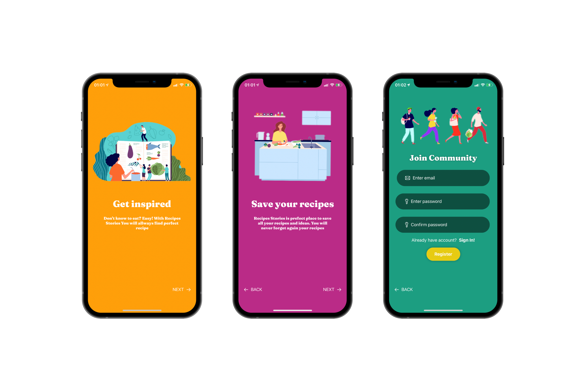
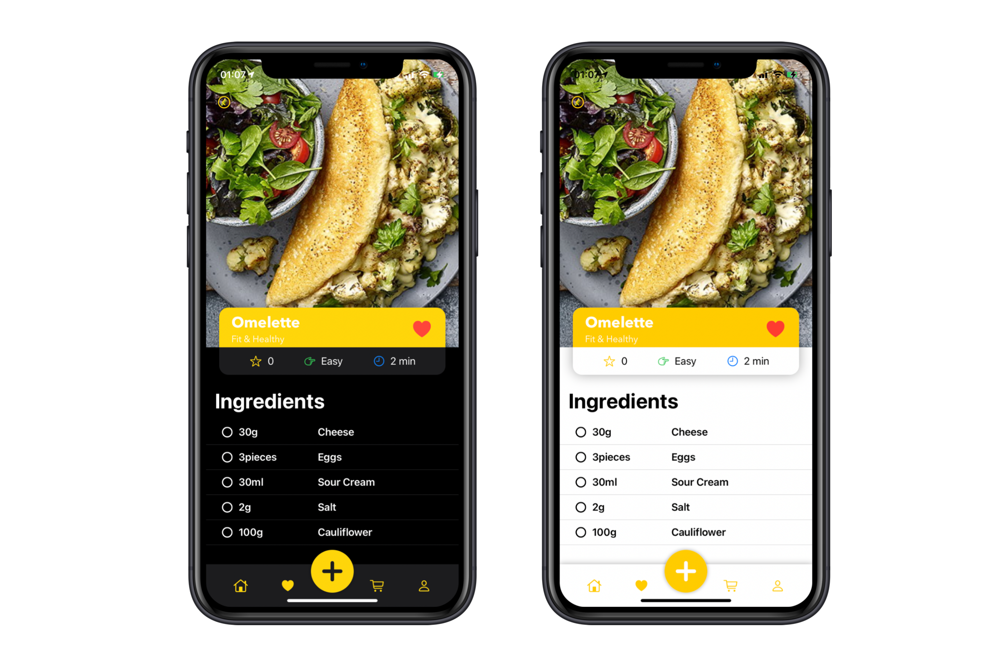

# Recipes Stories

>Recipes Stories is prefect place to save all your recipes and ideas. You will never forget again your recipes. Don't know to eat? Easy! With this app You will allways find perfect recipe.
  
  

## Welcome & Login Screen

 
 
## Add Recipe Screen

## Light & Darkmode

## App funcionality
  - Create new account and login
  - Add new recipes with list of ingredients and method steps
  - Add pictures
  - Save recipes into Core Data
  - Save recipes into Realtime Database
  
## Features to be implemented
   - share recipes
   - rate other recipes  
   - shopping list
   
## About app

  - SwiftUI based modern interface
  - Implementation on MVVM pattern
  - Integration UIKit view & SwiftUI using UIViewRepresentable
  - Light & Dark Mode compability
  - Firebase Cloud based login
  - Firebase Realtime Database 
  - Apple CoreData on device persisetnt storage 
 
 
  
## Tech
Recipes Stories uses a number of technologies:

* [Apple SwiftUI] - interface created with SwiftUI.
* [Apple Core Data] - enabling offline storage of recipes.
* [Firebase Authentication] - enabling login into app using email and password.
* [Firebase Realtime Database] - enabling cloud storage of recipes.

[Firebase Realtime Database]: <https://firebase.google.com/docs/database>
[Firebase Authentication]: <https://firebase.google.com/docs/auth>
[Apple Core Data]: <https://developer.apple.com/documentation/coredata>
[Apple SwiftUI]: <https://developer.apple.com/documentation/swiftui/>
